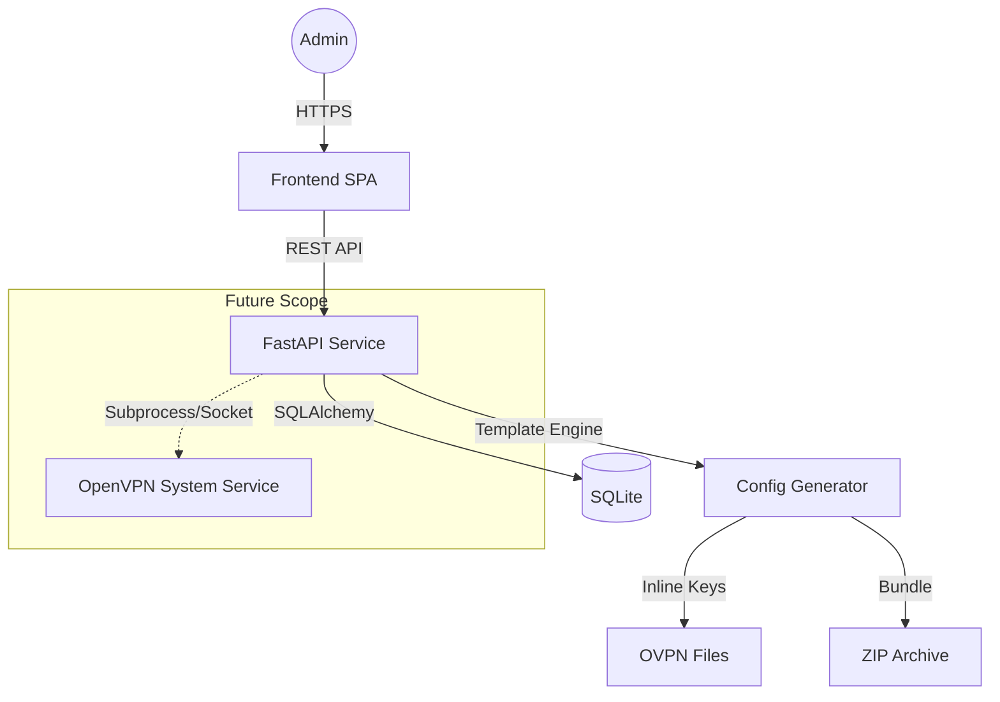

# Architecture Document: OpenVPN Config Management Service

## 1. Objective
To build a "one-click solution" for generating OpenVPN configuration bundles. The service aims to simplify the process of issuing client certificates through a modern web interface, while maintaining flexibility for future expansion into full VPN server management.

## 2. Core Concepts
- **Simplified Workflow**: A single administrator generates and downloads a ZIP archive containing all necessary configuration files.
- **Inline Configurations**: All certificates and keys are embedded directly into the `.ovpn` files for ease of use.
- **State Management**: Use SQLite to track issued certificates, allow for re-issuance, and manage client metadata.
- **Container-First, OS-Ready**: Initially runs in Docker for portability, but the architecture must allow for direct OS interaction (e.g., managing a running OpenVPN service via `systemctl`) in future iterations.

## 3. Technology Stack
- **Backend**: FastAPI (Python 3.12+)
- **Frontend**: React or Vue.js (SPA) communicating via REST API.
- **ORM**: SQLAlchemy 2.0.
- **Database**: SQLite (local file-based storage).
- **Crypto Logic**: `cryptography` and `pycryptodome` (migrated from current `main.py`).
- **Packaging**: `shutil` / `zipfile` for generating the final download archive.

## 4. System Architecture

### 4.1 Component Diagram

### 4.2 Data Model (SQLAlchemy)
- **Settings**: Stores global crypto parameters (Algorithm, Key Size, Server IP/Port) and raw Jinja2 templates for `server.conf` and `client.ovpn`.
- **Clients**: Tracks issued certificates.
    - Fields: `id`, `common_name`, `created_at`, `revoked_at`, `serial_number`, `metadata_json`.

## 5. Key Features

### 5.1 Dynamic Templates
Instead of hardcoded strings, the service will use a template-based approach. The admin can modify the OpenVPN boilerplate via the web UI. Keys (CA, Cert, Private Key, TLS-Crypt) will be injected using placeholders.

### 5.2 One-Click ZIP Generation
When a new client is added:
1. The backend generates a new RSA key pair and signs the certificate.
2. It compiles the `client.ovpn` using the active template.
3. It bundles the `.ovpn` and any additional instructions into a ZIP file.
4. The file is streamed directly to the admin's browser.

### 5.3 Extensibility for "Service Management"
To support future full-service management:
- An **Abstraction Layer** (Provider Pattern) will be implemented. 
- Currently: `StaticGeneratorProvider` (just creates files).
- Future: `SystemdServiceProvider` (creates files + restarts service + monitors logs).

## 6. Security
- **Admin Access**: Optional password protection via a simple environment variable (`ADMIN_PASSWORD`).
- **Secret Storage**: CA private keys and seeds are stored in a protected volume/directory (`/secrets`) with restricted filesystem permissions.
- **No-Persistence Option**: The system can be configured to not store private keys in the database, only the public metadata.

## 7. Implementation Roadmap

### Phase 1: API &amp; DB
- Implement SQLAlchemy models and SQLite initialization.
- Port `main.py` logic into a `VpnService` class.
- Create FastAPI endpoints for client listing and ZIP generation.

### Phase 2: Frontend
- Build a "Dashboard" view listing all clients.
- Add a "Generate" modal for one-click creation.
- Add a "Settings" page for crypto and template editing.

### Phase 3: Dockerization
- Create a multi-stage `Dockerfile`.
- Set up `docker-compose.yml` with persistent volumes for the SQLite DB and PKI secrets.
